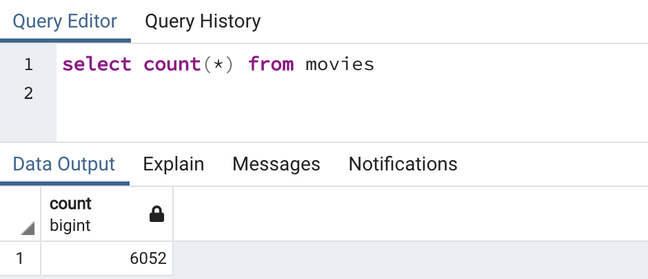
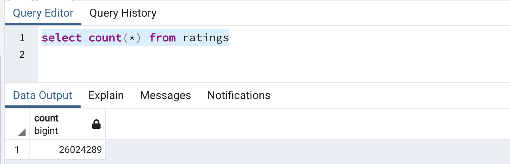

# Amazing Prime Hack Day Preparation

## Overview of the Project

Amazing Prime Video is a platform for streaming movies and TV shows. They are looking to develop an algorithm to predict which low budget movies being released will become popular so that they can buy the streaming rights at a bargain. Amazing Prime plans to involve all the teams as part of this effort in a hackathon event. Inorder to prepare for this event a good dataset of all the movies and its attributes were required.

In this project to prepare the data set using 3 sources, scrape of wikipedia data for all movies from 1990, a dataset from kaggle on movies and rating data from Movie Lens website, need to extract, transform and load for the analysis. The code also need to be build in such a way that it can be reusable for repeated use

## Resources
- Data Source: ratings.csv, movies_metadata.csv, wikipedia-movies.json
- Software: Python 3.9.7, Jupyter Notebook, Posgres, PGAdmin
---

## Results

The 3 input data sets were extracted.

As part of transformation
 - Column were dropped / renamed as required 
 - List was filtered to use only movies
 - Duplicates were removed 
 - Removed columns that have null values
 - Box office and Budget where transformed using regex to extract the amount from field 
 - release date was also transformed using regex from different formats to a common date format
 - runtime was also trasformed using regex to a common runtime
 - For common columns between Kaggle data set and Wiki Dataset, one was chosen based on data accuracy and availability. Missing values were filled from the other
 - Movie data was merged with the ratings 

Finally all this clean data was loaded to 2 tables in postgres movies and ratings

Count of records in movies table in postgres

Count of records in ratings table in postgres

---

## Summary

The application was built using functions such that going forward just passing the input data files, the entire process can extract, transform and load without any additional manual intervention.